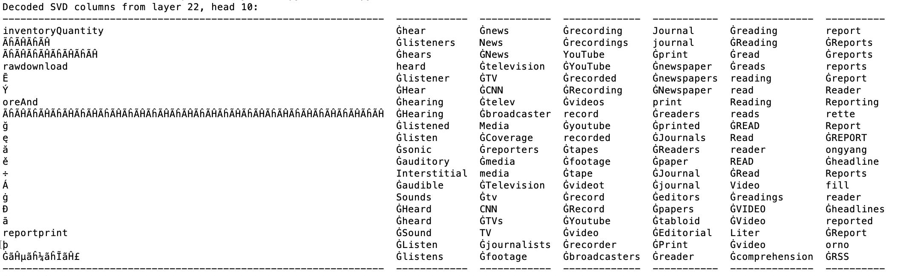

# "The Singular Value Decompositions of Transformer Weight Matrices are Highly Interpretable" Replication
Minimal replication of the core result of Millidge &amp; Black's "[The Singular Value Decompositions of Transformer Weight Matrices
are Highly Interpretable](https://www.alignmentforum.org/posts/mkbGjzxD8d8XqKHzA/the-singular-value-decompositions-of-transformer-weight)".
This replicates OV circuit interpretability via SVD for GPT-2-medium. See the linked paper for context and the full results.

